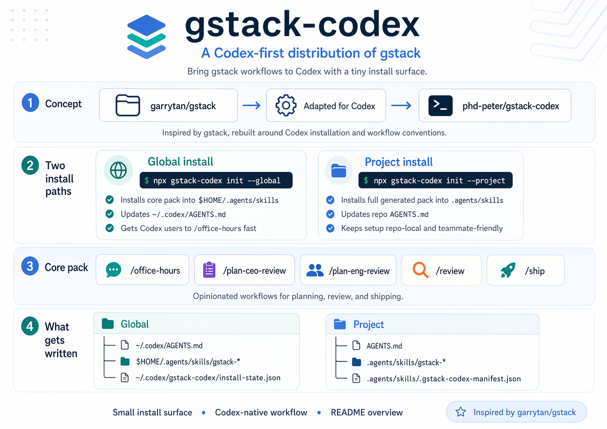
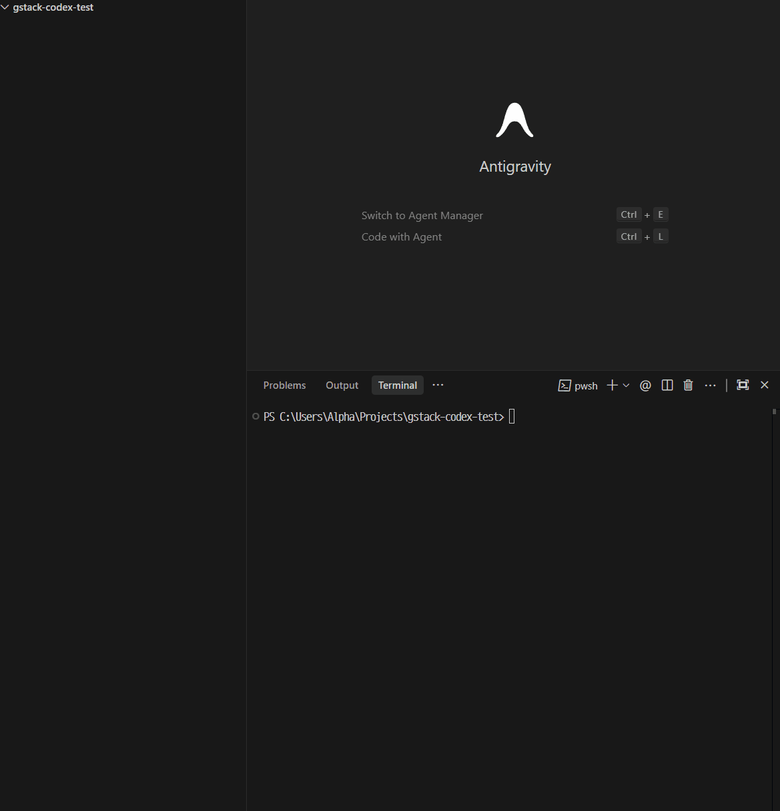

# gstack-codex



> Codex is powerful. `gstack-codex` makes it easy, deep, and fast.

`gstack-codex` turns Codex into an opinionated product-building workflow in minutes.

It brings Garry Tan's upstream [`gstack`](https://github.com/garrytan/gstack)
workflow to Codex with a smaller install surface, managed `AGENTS.md` wiring,
and guided skills instead of a blank prompt.

```bash
npx gstack-codex init --project
npx gstack-codex init --global
```



> Fast initial install. From blank repo to guided Codex workflow in minutes.

Most people should start with `init --project`.
Use `init --global` on a clean Codex-only machine.

## What You Get In 5 Minutes

- a guided `/office-hours` flow instead of staring at a blank Codex prompt
- structured `/plan-ceo-review`, `/plan-eng-review`, `/review`, and `/ship`
  workflows
- repo-local `AGENTS.md` wiring and generated skills without manual setup
- a Codex session that feels like a real agent workflow, not raw terminal driving

## Why This Exists

- Plain Codex is powerful, but the first session can feel ambiguous if you do
  not already know how to drive agent workflows.
- Upstream `gstack` on Claude Code is proven and deep, but it is still a
  Claude-first setup.
- `gstack-codex` is the easiest path to a deep, opinionated `gstack` workflow
  on Codex.

## Quick Start

Recommended for most users, per project:

```bash
npx gstack-codex init --project
```

Global install, mainly for a clean Codex-only machine:

```bash
npx gstack-codex init --global
```

Prerequisites:

- `codex` CLI `0.122.0+`
- a signed-in Codex session
- Node.js `18.17+`

After install:

1. Open Codex in your repo.
2. Run `/office-hours`.
3. If your Codex surface does not expose slash commands yet, simply ask it to
   start office hours.
4. Turn a vague idea into a design doc and follow-up plan instead of starting
   from scratch.

Detailed install notes live in [docs/install.md](docs/install.md).

## Install Modes

`init --project` is the repo-local path.
It installs the full generated skill pack into `.agents/skills`, updates
`AGENTS.md` with one managed block, and keeps heavy browser/runtime binaries
machine-local in v1.
If you are not inside a git repo, it uses the current directory as the project
root.

`init --global` is the clean-machine path.
It installs the core pack into `$HOME/.agents/skills`, updates
`~/.codex/AGENTS.md` with one managed block, and is meant to get a Codex-only
user to `/office-hours` quickly.

Compared to setting up upstream `gstack` by hand, `gstack-codex` removes most
of the fiddly parts.
Instead of cloning skill repos, running setup scripts, and wiring `AGENTS.md`
yourself, you run one command and get the managed block, the packaged skills,
and the expected Codex layout in place.

## What Gets Written

Global install writes:

- `~/.codex/AGENTS.md`
- `$HOME/.agents/skills/gstack`
- `$HOME/.agents/skills/gstack-upgrade`
- `$HOME/.agents/skills/gstack-office-hours`
- `$HOME/.agents/skills/gstack-plan-ceo-review`
- `$HOME/.agents/skills/gstack-plan-eng-review`
- `$HOME/.agents/skills/gstack-review`
- `$HOME/.agents/skills/gstack-ship`
- `~/.codex/gstack-codex/install-state.json`

Project install writes:

- `AGENTS.md`
- `.agents/skills/gstack`
- `.agents/skills/gstack-*`
- `.agents/skills/.gstack-codex-manifest.json`

The installer only manages one block inside `AGENTS.md`.
If no `AGENTS.md` exists, it creates one.

## Maintainer Flow

Release artifacts are built from the vendored upstream checkout under
`.agents/skills/gstack`.

Build the staged release bundle:

```bash
npm run build:release
```

Build the staged bundle and create the npm tarball artifact:

```bash
npm run pack:release
```

This flow writes:

- `bundle/current`
- `dist/releases/<version>/bundle`
- `dist/releases/<version>/release.json`
- `dist/releases/<version>/SHA256SUMS.txt`
- `dist/releases/<version>/npm/*.tgz` after `pack:release`

More detail is in [docs/release.md](docs/release.md).
